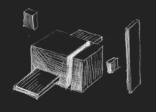
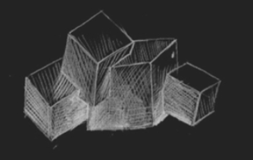
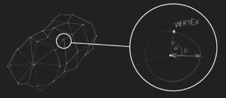

# Avion cu Motor 

# Gameplay

Jocul va fi un endless runner cu un avion într-o mișcare continuă de la stânga la dreapta. Pentru control avionul va urmări mouse-ul în deplasarea sus-jos. În momentul în care avionul merge în sus, acesta va fi rotit corespunzător cu partea din față a avionului orientată înspre cer. Când acesta merge în jos, avionul va fi rotit înspre mare.

Pilotul va avea un total de 3 vieți. În scenă, vor apărea periodic obstacole pe care pilotul trebuie să le evite. Dacă nu reușește să le evite și intră în ele, acesta va pierde o viață. În momentul în care rămâne fără vieți, jocul s-a terminat.

De asemenea, pilotul trebuie să aibă în calcul și cât combustibil mai are. Combustibilul se consumă constant în timp sau în momentul accelerării. În momentul în care rămâne fără combustibil, jocul s-a terminat. Pentru a nu rămâne fără combustibil, pilotul trebuie să adune cât mai multe obiecte de combustibil.

Pentru a evidenția finalul jocului se va implementa o animație de prăbușire a avionului prin rotirea și căderea acestuia în jos (vedeți un exemplu la finalul demo-ului).

Jucătorul va avea la dispoziție o cameră first person și o cameră third person asemănătoare cu cea din demo. Se poate schimba între cele două camere prin apăsarea tastei C.

# Construcția Scenei

**Avionul**
Pentru a crea avionul, veți folosi mai multe forme simple. De exemplu, puteți folosi cuburi de mărimi și culori diferite. Astfel, puteți avea două cuburi pentru aripi, un cub pentru coadă, un cub pentru corp, un cub pentru cap, un cub pentru elice și un cub pentru suportul de elice. De asemenea, elicea avionului trebuie să se rotească în continuu (exemplu în figura de mai jos).

**Norii** 
Norii vor fi și ei, la rândul lor, construiți din mai multe forme simple. Puteți să îi construiți, folosind 4 cuburi poziționate aleator unul lângă altul. Un exemplu de nor aveți în figura de mai jos. Norii trebuie să aibă o animație (de exemplu să se rotească anumite cuburi din componența lor).

**Marea**
Pentru a crea marea deasupra căreia zboară avionul, veți folosi un cilindru pe care îl veți plasa centrat în partea de jos a ecranului. Pentru realism, marea va avea valuri generate și se va roti în continuu. Valurile vor fi realizate în Vertex Shader prin deformări aleatoare, dar care sa asigure o continuitate in timp (de exemplu se pot defini varfuri interioare cilindrului cu pozitii distorsionate ca in figura, iar apoi se poate aplica in vertex shader o rotație în jurul poziției inițiale pentru fiecare vertex al cilindrului, fiecare astfel de rotație având viteză și rază aleatoare definita pentru vertexul respectiv)

**Obstacole**
Obstacolele vor fi reprezentate în scenă prin obiecte de culoare roșie (de exemplu sfere) cu o animație de rotație. În momentul coliziunii cu avionul acestea dispar iar jucătorul pierde o viață.

**Combustibil** 
Alimentarea avionului se poate face din zbor prin colectarea obiectelor de combustibil. Acestea vor fi reprezentate de obiecte cu o culoare turcoaz, vor dispuse într-o înșiruire arcuită și vor avea o animație de rotire permanentă. Pot fi reprezentate spre exemplu prin obiecte de tip Teapot. În momentul coliziunii cu avionul acestea dispar, iar combustibilul avionului va crește.

[DEMO](https://www.youtube.com/watch?v=s6gM2GBF3Ek&feature=emb_title) :eyes:
